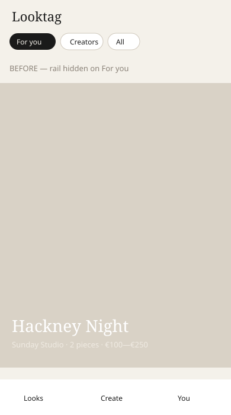
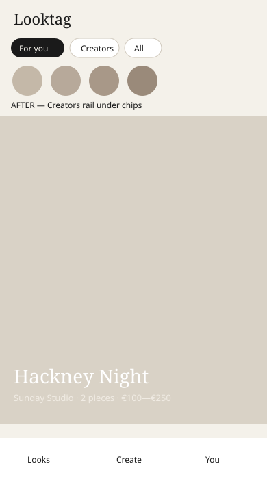

# Issue #40 — Creators rail on phone For you

Live Playwright captures from local `vite dev` on branch `phase1/b-creators-rail-foryou` (browse coach dismissed).

Schematic before/after (phone For you). Live JPEG-embed SVGs optional companions when binary push succeeds.

## Phone For you

| Before (`main`) | After |
| --- | --- |
|  |  |

## Expected

| Surface | Behavior |
| --- | --- |
| Phone For you | Creators avatar rail visible when creators exist |
| Phone Creators | Rail unchanged (still visible) |
| Mood / Saved / All | Rail hidden |
| Desktop ≥768px | Rail hidden (CSS) |
| Avatar tap | Filter → Creators + focus that creator |
| Empty For you | Title once; body does not repeat “Nothing here yet” |
