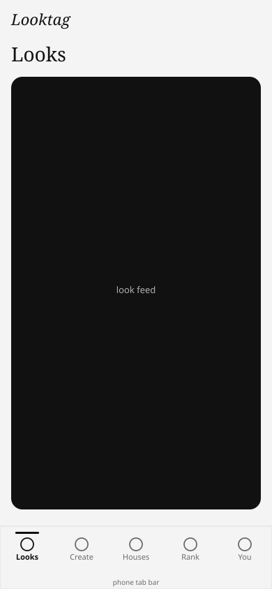
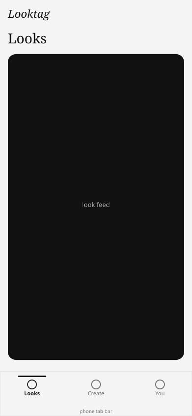
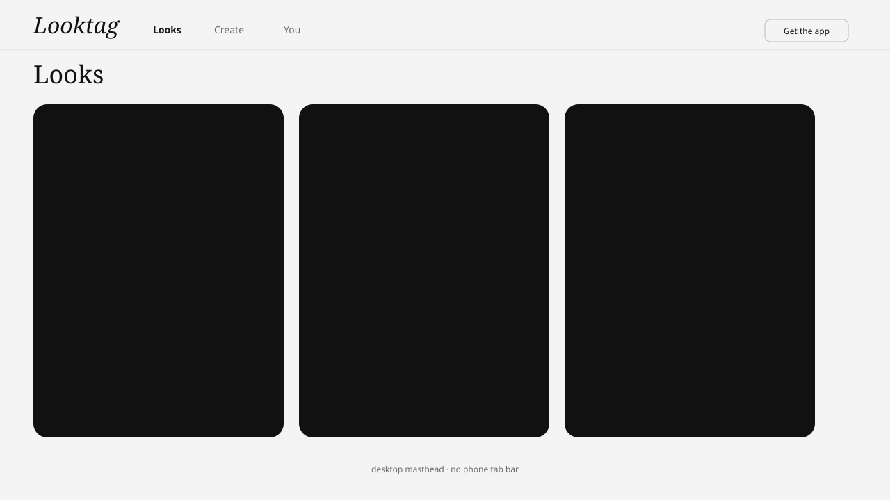

# Phase 1 slice A — chrome before/after

Mock chrome frames (Looktag ink palette) showing shopper nav trim.

## Phone tab bar

| Before | After |
| --- | --- |
|  |  |

Also: [before PNG](./before-phone.png) · [after PNG](./after-phone.png)

## Desktop masthead

| Before | After |
| --- | --- |
|  |  |

Also: [before PNG](./before-desktop.png) · [after PNG](./after-desktop.png)

## Expected chrome

| Surface | Items |
| --- | --- |
| Phone tab bar | Looks · Create · You |
| Desktop masthead | Looks · Create · You |
| Removed from shopper shell | Rank, Houses, How-to |

`/rank` and `/houses` remain deep-linkable.

## Tokens

`src/styles.phase1-a.css` (`:root`) + `src/lib/design/system.ts`:

- `--space-thumb` (4.5rem)
- `--space-sheet-pad` (1rem) + `.sheet-footer-pad`
- `--target-min` (44px)
- `--keyboard-inset` default `0px` (viewport-lock still overrides)
