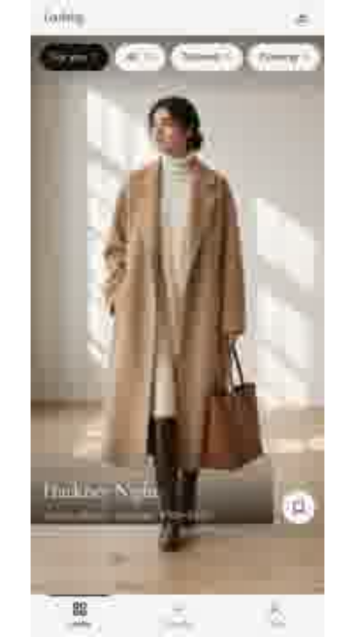
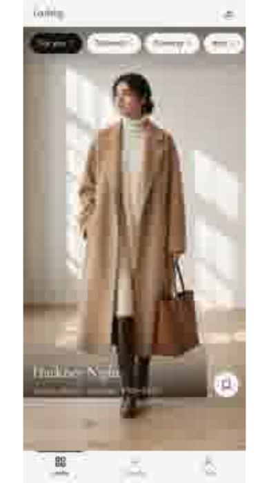
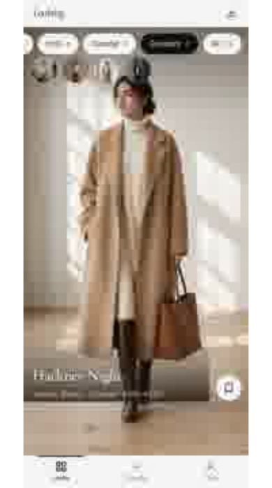
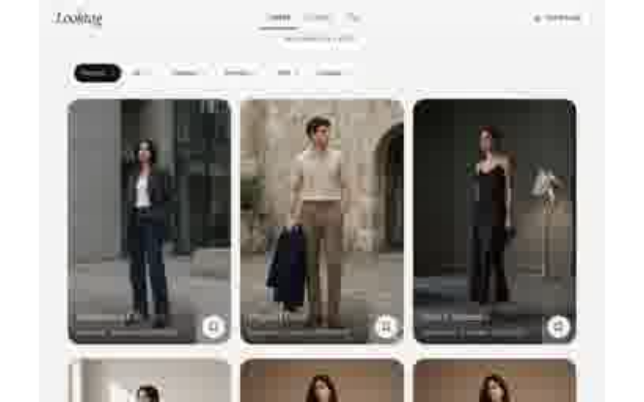
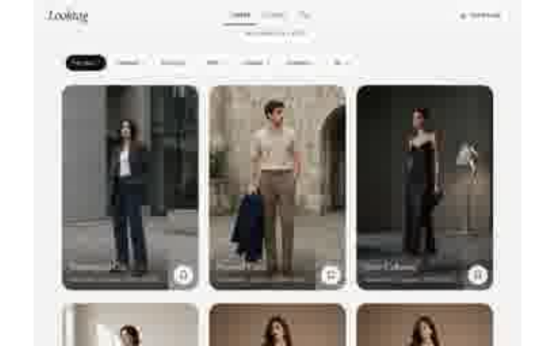

# Phase 1 slice B — Discovery (board-01) before/after

Live Playwright captures from local `vite dev` on branch `phase1/b-discovery` (style guide + browse coach dismissed).

PNG originals preferred; SVG companions embed the same JPEG captures for reliable GitHub preview.

## Phone

| Before (main) | After |
| --- | --- |
|  |  |

Creators avatar rail (phone, Creators chip):

## Desktop (≥768 website)

| Before (main) | After |
| --- | --- |
|  |  |

## Expected (board-01)

| Surface | Behavior |
| --- | --- |
| Default | For you when labels enabled |
| Chips | For you → moods → Creators → Saved (All secondary) |
| Plate meta | house\|creator · pieces · soft band |
| Phone | full-bleed plates + Creators avatar rail + safe-area tabs |
| Desktop | masthead + portrait plate grid with gutters (no tab bar) |
| Empty For you | board copy + Browse All styles / Creators |
| Not on plates | More like this; Rank/Houses/How-to chrome |
