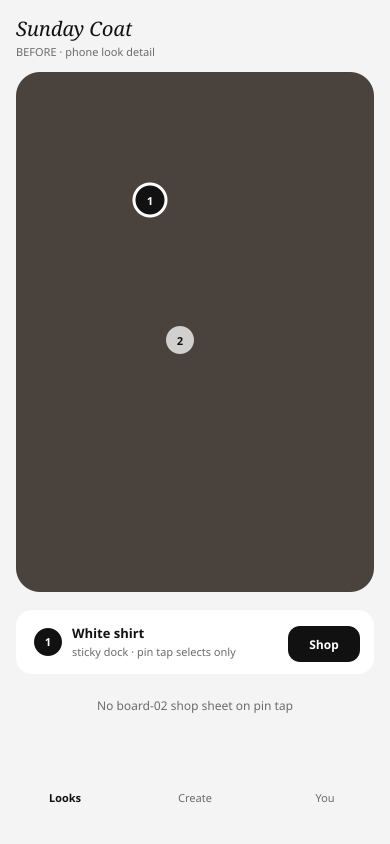
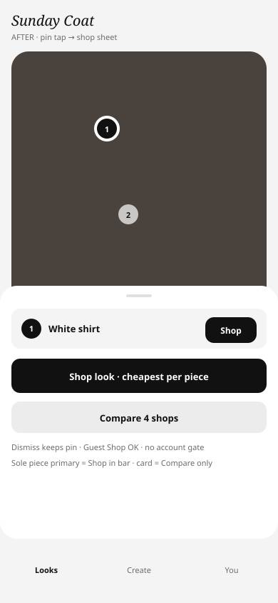
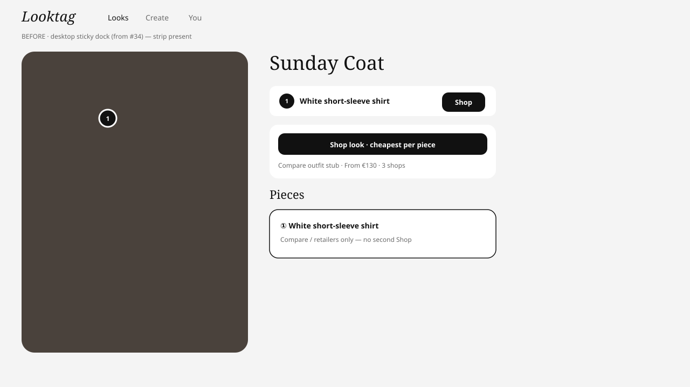
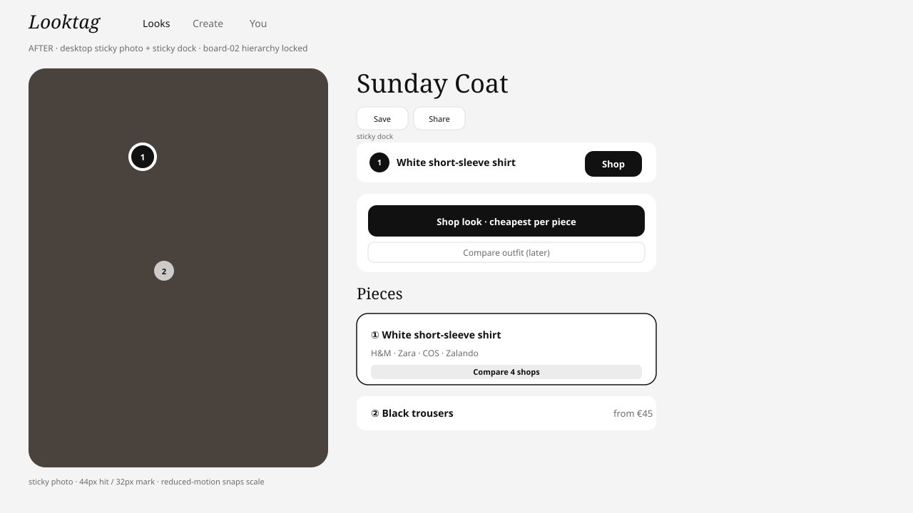

# Phase 1 slice C — Shop skins (board-02) before/after

Live: https://rocket-trail-sunny-yonder.grok.me · seed `/looks/seed-sunday-coat`

Ink-palette schematics (SVG). Playwright captures verified locally on branch (phone sheet + desktop dock).

## Phone — pin tap → shop sheet

| Before (main sticky dock) | After (board-02 shop sheet) |
| --- | --- |
|  |  |

## Desktop — sticky photo + sticky dock

| Before | After |
| --- | --- |
|  |  |

## Board-02 checklist

| Item | Status |
| --- | --- |
| Sticky bar Shop = sole piece primary | Yes (#34 + C) |
| Expanded card = Compare/retailers only | Yes |
| Look strip: Shop look · cheapest; Compare outfit `(later)` stub | Yes |
| Desktop sticky photo + sticky dock | Yes |
| Phone pin tap → shop sheet; dismiss keeps pin | Yes (slice C) |
| Guest Shop / anonymous share | Yes — never gated (`data-guest-shop`) |
| Pins 44 hit / 32 mark; reduced-motion | Yes |
| More like this | Slice D — not in C |
