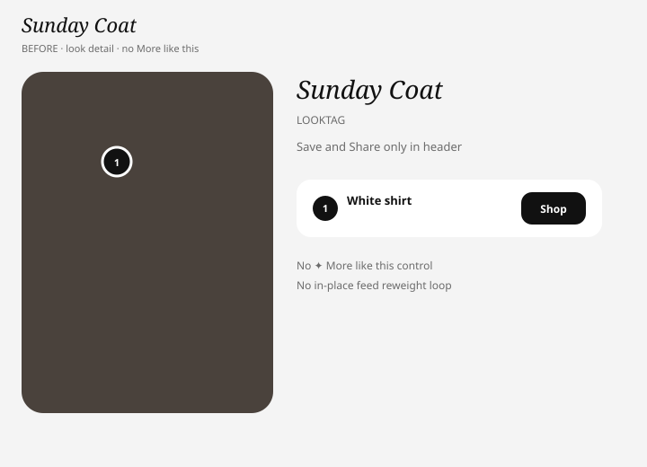
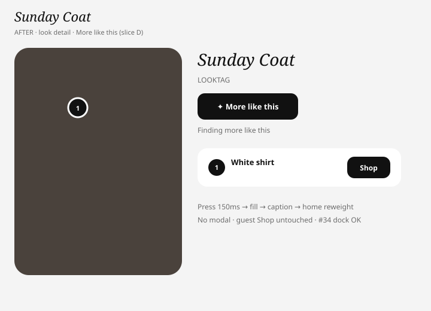
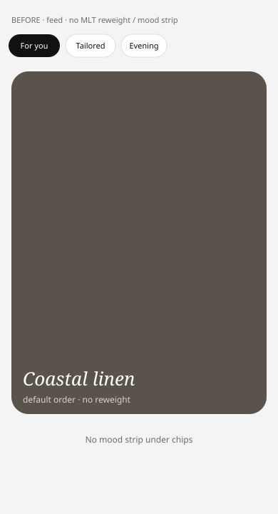
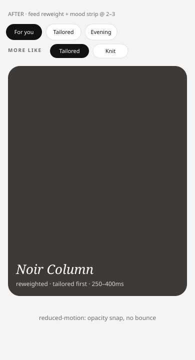

# Phase 1 slice D — More like this (board-02 loops)

Live: https://rocket-trail-sunny-yonder.grok.me · seed `/looks/seed-sunday-coat`

Ink-palette schematics (SVG).

## Look detail — More like this control

| Before | After |
| --- | --- |
|  |  |

## Feed — in-place reweight + mood strip

| Before | After |
| --- | --- |
|  |  |

## Board-02 / ENG-BRIEF checklist

| Item | Status |
| --- | --- |
| Control on look detail only (not plates) | Yes |
| In-place feed reweight (no modal) | Yes — navigate home + slot reorder + motion-slow |
| Mood strip after 2–3 uses | Yes — under chips when activations ≥ 2 |
| Reduced-motion path | Yes — opacity snap, no scale bounce |
| Guest Shop / #34 dock / C sheet | Untouched |
